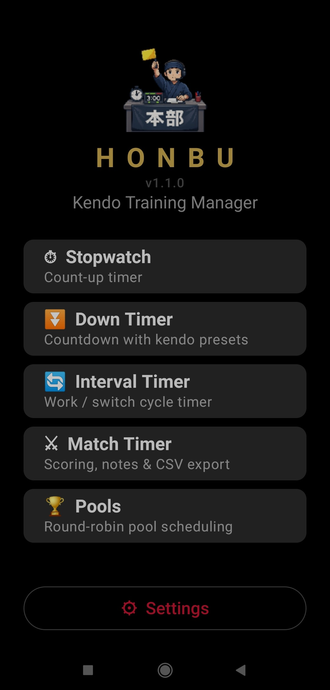
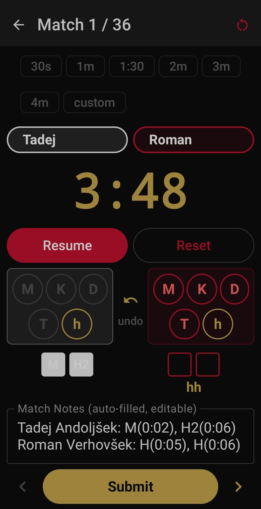

# Honbu — Kendo Training Manager

An Android app for timing kendo matches and drills, organizing them and recording results. It's built with Kotlin and Jetpack Compose.

## Features

- **Stopwatch, countdown timer, and interval timer** for general training drills
- **Match Timer** with full kendo scoring (Men, Kote, Do, Tsuki, Hansoku), encho support, undo, and CSV export
- **Pool scheduling** with multiple round-robin algorithms:
  - Circle method (Berger tables)
  - Rest-optimized (maximizes gaps between matches)
  - Clustered (engagement-score algorithm with selectable streak length 2–5)
  - Random / Random with rest
- **Member management** allows manually additing or removing members or importing them all at once as a -csv.
- **Configurable sounds** for timer events with built-in kendo-themed audio
- Dark, kendo-inspired theme with crimson/gold accents

## Instructions for use
### Importing Members

Before creating pools, populate your member list:

1. Tap **Settings** from the main menu
2. Scroll to **Members** section
3. Tap **Import from CSV**
4. Select a file with one name per line (e.g., `members.txt`)
   - **Supported encodings:** UTF-8 and Windows-1250 (CP1250)
   - Duplicates are automatically skipped
   - Example file:
 Alice
 Bob
 Charlie
5. Members appear in the list below; tap the trash icon to remove any

Alternatively:
You can also add members by writing them one by one in settings.

### Match Timer

Score an individual match:

1. From main menu, tap **Match Timer**
2. Select white and red players from the dropdowns
3. Tap **Start** to begin the match (or **Pause** to pause)
4. When a player scores:
   - Select the scoring technique (Men, Kote, Do, Tsuki) from their column
   - The score updates automatically
5. If the match reaches a draw (both players at 2 points), **Encho** is offered automatically
6. To undo the last score, tap the **↶** icon. You can also edit it in the match notes field.
7. When done:
   - Tap **Submit** to save the result to CSV. Make sure to always save your results before leaving the match's screen.
   - A confirmation dialog appears; confirm to export
   - Results are saved to `Downloads/honbu_matches.csv` by default
   - To change the save location: go to **Settings → CSV Save File → Save as…**

### Pools & Round-Robin Scheduling

Schedule and score matches for a group:

1. Tap **Pools** from main menu
2. **Setup** tab:
   - Select players from your member list (checkboxes on the right)
   - Choose a schedule type:
     - **Circle method:** Standard Berger tables
     - **Rest-optimized:** Minimizes consecutive fights per player
     - **Clustered:** Selectable streak length (2–5 matches where one player stays); uses engagement-scoring for balanced rotation
     - **Random / Random with rest:** Shuffled or semi-random with rest gaps
   - If using Clustered, select streak length (2, 3, 4, or 5)
   - (Optional) Pick specific players for the first match using the dropdowns
   - Tap **Generate Schedule**
3. **Match List** tab:
   - All matches appear in order
   - Use **▲/▼** to manually reorder matches
   - Tap **▶** to jump to a match
   - Tap **Reset Pool** to discard the schedule and start over
4. **Match Timer** tab:
   - Score the match same as individual Match Timer (see above)
   - Tap **Submit** when done; the result is saved and a confirmation notification appears
   - Use **◀/▶** to navigate to previous/next match
   - Tap **↺** to clear the timer and undo the submission (allows re-scoring)
5. After all matches, results are in `honbu_matches.csv` (customizable in Settings)

### Timers

Three timers available from the main menu:

- **Stopwatch:** Runs indefinitely; tap **Lap** to mark time splits
- **Down Timer:** Set a duration and count down to zero, includes preset time buttons matching common times of kendo matches and exercises. Alternatively, you can set a custom duration.
- **Interval Timer:** Set work/rest intervals and number of rounds; useful for drill circuits

Configure timer sounds in **Settings → Sounds**.
App will prevent screen from turning off automatically while any timers are running.

### CSV Export & Backup

Results are saved to a single CSV file with headers. You can:

- Change the file location: **Settings → CSV Save File**
  - **Save as…** creates a new file at your chosen location
  - **Use existing…** appends to an existing CSV
  - **Reset to default** reverts to `Downloads/honbu_matches.csv`
- Open the CSV in Excel or Google Sheets for analysis
- The file uses UTF-8 encoding with BOM for compatibility

## Tech Stack

- Kotlin + Jetpack Compose
- Room database for persistence
- DataStore for preferences
- MediaStore / Storage Access Framework for CSV export
- MVVM architecture with StateFlow

## Build

Requires Android Studio. Minimum SDK 26, target SDK 34.

## Status

Active personal project, v1.1.0."# Honbu---kendo-training-managment-app" 
